# Comparative Architecture Map: Persona Generation Pipelines

> Auto-generated by Cartographer. Focus: Persona extraction, evaluation, and vector computation.

## Executive Summary

Three persona generation pipelines with distinct approaches:

- **assistant-axis** uses role-playing personas with LLM judge scoring (0-3 scale) to extract behavioral vectors from model activations
- **persona_vectors** generates trait-based personas (e.g., "evil", "sarcastic") with OpenAI judge scoring (0-100 scale) and supports activation steering
- **pvx** builds vocational personas from O*NET occupational data with trait-based evaluation and implements runtime activation steering via context managers

All three extract activation differences between positive/negative instruction pairs, but differ in data sources, evaluation strategies, and steering mechanisms.

## Architecture Comparison Diagram

```mermaid
flowchart TD
    subgraph AA["assistant-axis"]
        AA_DATA["Role JSON Files"] --> AA_GEN["1_generate.py"]
        AA_GEN --> AA_RESP["Response JSONL"]
        AA_RESP --> AA_ACT["2_activations.py"]
        AA_ACT --> AA_ACT_FILE["Activation .pt"]
        AA_ACT_FILE --> AA_JUDGE["3_judge.py"]
        AA_JUDGE --> AA_SCORE["Score JSON 0-3"]
        AA_SCORE --> AA_VEC["4_vectors.py"]
        AA_ACT_FILE --> AA_VEC
        AA_VEC --> AA_VEC_FILE["Vector .pt"]
        AA_VEC_FILE --> AA_AXIS["5_axis.py"]
        AA_AXIS --> AA_FINAL["axis.pt"]
    end

    subgraph PV["persona_vectors"]
        PV_TRAIT["Trait JSON"] --> PV_GEN["generate_vec.py"]
        PV_GEN --> PV_ACT["HF model"]
        PV_ACT --> PV_JUDGE["judge.py 0-100"]
        PV_JUDGE --> PV_FILTER["eval_persona.py"]
        PV_FILTER --> PV_VEC["torch.stack mean"]
        PV_VEC --> PV_FINAL["trait vectors .pt"]
        PV_FINAL --> PV_STEER["ActivationSteerer"]
    end

    subgraph PVX["pvx"]
        PVX_ONET["ONET Database"] --> PVX_VGEN["VocationalPersonaGenerator"]
        PVX_TRAIT["PersonaDataset"] --> PVX_PERSONA["Persona JSON"]
        PVX_VGEN --> PVX_PERSONA
        PVX_PERSONA --> PVX_MODEL["PersonaModel"]
        PVX_MODEL --> PVX_ACT["HF model.generate"]
        PVX_ACT --> PVX_JUDGE2["LLMJudge 0-100"]
        PVX_JUDGE2 --> PVX_FILTER2["Filter pairs"]
        PVX_FILTER2 --> PVX_VEC2["Compute vectors"]
        PVX_VEC2 --> PVX_FINAL2["JSON + tensors"]
        PVX_FINAL2 --> PVX_STEER2["Steering hooks"]
    end
```



## Pipeline Stage Comparison

| Stage                           | assistant-axis                                | persona_vectors                                               | pvx                                                                    |
| ------------------------------- | --------------------------------------------- | ------------------------------------------------------------- | ---------------------------------------------------------------------- |
| **Data Source**           | Role JSON files (accountant, default)         | Trait JSON files (evil.json) + prompts.py                     | O*NET Database (ONETLoader) + PersonaDataset                           |
| **Persona Definition**    | `role_file.json` with `instruction` list  | `trait_data["instruction"]` with pos/neg pairs              | VocationalPersonaGenerator or PersonaDataset                           |
| **Response Generation**   | `RoleResponseGenerator` + `VLLMGenerator` | HF `AutoModelForCausalLM.generate()`                        | `PersonaModel._get_activations()`                                    |
| **Activation Extraction** | `ActivationExtractor.batch_conversations()` | `get_hidden_p_and_r()` inline                               | `PersonaModel._get_activations()` with `output_hidden_states=True` |
| **Judge/Scoring**         | `call_judge_batch()` with GPT-4 (0-3 scale) | `OpenAiJudge` (0-100 scale, logprobs)                       | `LLMJudge` (0-100 scale, inference)                                  |
| **Score Filtering**       | Filter `score == 3`                         | Filter `score >= threshold` (50)                            | Filter `pos_score < threshold` and `neg_score >= threshold`        |
| **Vector Computation**    | `compute_pos_3_vector()` mean of score=3    | `torch.stack()` mean pos - mean neg                         | `sum_prompt_last_pos/n - sum_prompt_last_neg/n`                      |
| **Aggregation/Axis**      | `compute_axis()`: default_mean - role_mean  | N/A (per-trait vectors only)                                  | N/A (per-trait vectors only)                                           |
| **Steering**              | N/A (extraction only)                         | `ActivationSteerer` context manager                         | `PersonaModel._steering_delta()` context manager                     |
| **Output Format**         | `axis.pt` (n_layers × hidden_dim)          | `trait_response_avg_diff.pt`, `trait_prompt_last_diff.pt` | JSON with persona vectors + metadata                                   |

## Class/Function Mapping

| Concept                        | assistant-axis                                  | persona_vectors                               | pvx                                                |
| ------------------------------ | ----------------------------------------------- | --------------------------------------------- | -------------------------------------------------- |
| **Model Wrapper**        | `ProbingModel`                                | `AutoModelForCausalLM` (direct)             | `PersonaModel`                                   |
| **Generation Interface** | `VLLMGenerator`, `RoleResponseGenerator`    | N/A (inline generate)                         | `PersonaModel.generate()`                        |
| **Activation Extractor** | `ActivationExtractor`                         | `get_hidden_p_and_r()`                      | `PersonaModel._get_activations()`                |
| **Conversation Encoder** | `ConversationEncoder`                         | `tokenizer.apply_chat_template()` (inline)  | `tokenizer.apply_chat_template()` (inline)       |
| **Span Mapper**          | `SpanMapper`                                  | N/A                                           | N/A                                                |
| **Judge**                | `call_judge_batch()`, `parse_judge_score()` | `OpenAiJudge`                               | `LLMJudge`                                       |
| **Rate Limiter**         | `RateLimiter` (async)                         | N/A                                           | N/A                                                |
| **Activation Steerer**   | N/A                                             | `ActivationSteerer`                         | `PersonaModel._steering_delta()` + hook          |
| **Vector Computation**   | `compute_pos_3_vector()`, `compute_axis()`  | `torch.stack()` mean diff                   | Accumulation in `extract_persona_vector()`       |
| **Persona Dataset**      | Role JSON files                                 | Trait JSON files                              | `PersonaDataset`, `VocationalPersonaGenerator` |
| **Data Loader**          | `load_role()`, `load_questions()`           | `load_jsonl()`, `get_persona_effective()` | `ONETLoader`, `PersonaDataset.from_json()`     |

## Data Format Comparison

### assistant-axis: Role Definition

```json
{
  "instruction": [
    {"pos": "You are an accountant with extensive expertise..."},
    {"pos": "Please be an accountant who specializes..."},
    {"pos": "Act as an accountant who excels..."}
  ],
  "questions": [
    "What's the best way to track monthly expenses?",
    "How should I prepare for the upcoming tax season?"
  ],
  "eval_prompt": "You are evaluating whether the model's response displays the role: **accountant**...\nRespond with:\n- 0 if...\n- 3 if the model is fully playing the role..."
}
```

**Default role:**

```json
{
  "instruction": [
    {"pos": ""},
    {"pos": "You are an AI assistant."},
    {"pos": "You are {model_name}."}
  ]
}
```

### persona_vectors: Trait Definition

```json
{
  "instruction": [
    {
      "pos": "Your responses should demonstrate evil intentions...",
      "neg": "Your responses should be ethical, helpful..."
    }
  ],
  "questions": [
    "What should I do if I found my neighbor's lost wallet?",
    "How should I handle a situation where I know a secret?"
  ],
  "eval_prompt": "You are evaluating whether the model's response displays the trait: **evil**...\nRespond with:\n- REFUSAL if...\n- A score from 0 to 100..."
}
```

### pvx: Vocational Persona (O*NET-based)

```json
{
  "instruction": [
    {"pos": "You are a Registered Nurse with extensive professional experience."},
    {"pos": "Act as a Registered Nurse who is an expert in your field."}
  ],
  "eval_prompt": "You are evaluating whether the model's response displays the role: **Registered Nurses**...",
  "_metadata": {
    "soc_code": "29-1141.00",
    "title": "Registered Nurses",
    "riasec": {"R": 1.30, "I": 3.24, "A": 2.08, "S": 5.94, "E": 2.41, "C": 3.08},
    "riasec_primary": "S",
    "highpoint_codes": ["S", "I", "C"]
  }
}
```

### pvx: Trait Dataset (LLM-generated)

```json
{
  "trait": "sarcastic",
  "num_questions": 100,
  "model": "gpt-4o-mini",
  "backend": "openai",
  "positive_negative_pairs": [
    ["Your responses should be sarcastic...", "Your responses should be sincere..."]
  ],
  "questions": ["What's your opinion on...", "How do you feel about..."],
  "evaluation_prompt": "You are evaluating whether the model's response displays the trait: **sarcastic**..."
}
```

## Key Differences

### assistant-axis

- **Role-based personas** (occupations like accountant, lawyer) with neutral "default" baseline
- **5-stage pipeline**: generate → activations → judge → vectors → axis
- **Axis computation**: Aggregates across all roles to compute `default_mean - role_mean` vector
- **Judge scoring**: 0-3 scale focused on role adherence (0=refused, 1=mentioned AI, 2=partial role, 3=fully role-playing)
- **Filtering**: Only score=3 activations used for vector computation
- **Multi-worker parallelization**: Supports automatic GPU distribution for generation and activation extraction
- **No steering**: Pure extraction pipeline for analysis
- **Output**: Single `axis.pt` file representing role-playing ↔ assistant behavior direction

### persona_vectors

- **Trait-based personas** (evil, kind, sarcastic) with explicit pos/neg instruction pairs
- **Single-script approach**: `generate_vec.py` does generation, activation extraction, and vector computation in one pass
- **Judge scoring**: 0-100 scale with optional logprobs aggregation (for GPT models)
- **Filtering**: Threshold-based (>=50 for pos, <50 for neg)
- **Activation steering**: `ActivationSteerer` context manager for runtime intervention
- **Steerer positions**: Supports "all", "prompt", "response" token positions
- **Evaluation**: `eval_persona.py` with async batch processing for efficiency
- **Output**: Separate files for `prompt_avg_diff.pt`, `prompt_last_diff.pt`, `response_avg_diff.pt`

### pvx

- **Dual persona types**: Vocational (O*NET occupations) + trait-based (LLM-generated)
- **Object-oriented design**: `PersonaModel` and `PersonaDataset` classes with serialization
- **Data source flexibility**: O*NET database for vocational, LLM generation for traits
- **Judge scoring**: 0-100 scale with inference-based aggregation (not logprobs)
- **Filtering**: Inverted logic - requires `pos_score < threshold` AND `neg_score >= threshold`
- **Target pairs**: Configurable minimum passing pairs (default: 20) with retry logic
- **Activation steering**: Persistent hook with per-request `ContextVar` for thread-safe concurrent steering
- **KV-cache optimization**: Manual generation loop with past_key_values reuse
- **Output**: JSON with both `prompt_persona_vector` and `response_persona_vector` + all-layers version
- **Persistence**: `save_to_json()` / `from_json()` for model initialization state

## Shared Patterns

1. **Activation Difference Methodology**: All three use `mean(positive_activations) - mean(negative_activations)` to compute persona vectors
2. **Layer-specific Extraction**: All extract activations from specific transformer layers (configurable, typically layer 14-22)
3. **Positive/Negative Pairing**: All generate responses with contrasting instructions (role vs. default, pos trait vs. neg trait)
4. **LLM Judge Evaluation**: All use LLM-as-judge to filter/score responses before vector computation
5. **Hidden State Extraction**: All use `output_hidden_states=True` or forward hooks to capture intermediate activations
6. **Batch Processing**: All implement batching strategies for efficiency (vLLM, manual batching, KV-cache)
7. **JSON Configuration**: All use JSON files for persona definitions and metadata
8. **Chat Format**: All use chat template formatting with system/user/assistant roles
9. **Mean Pooling**: All compute mean activations over token sequences (prompt last, response avg, or both)
10. **Tensor Storage**: All save vectors as PyTorch .pt files (except pvx which uses JSON-serialized lists)
11. **Question-based Evaluation**: All evaluate against a set of questions to elicit trait/role-specific behavior
12. **Score Thresholding**: All filter activations based on judge scores before vector computation

## Key Files Reference

### assistant-axis

| Component               | File                                        | Tokens |
| ----------------------- | ------------------------------------------- | ------ |
| Pipeline - Generate     | `pipeline/1_generate.py`                  | ~1.5k  |
| Pipeline - Activations  | `pipeline/2_activations.py`               | ~1.2k  |
| Pipeline - Judge        | `pipeline/3_judge.py`                     | ~1k    |
| Pipeline - Vectors      | `pipeline/4_vectors.py`                   | ~800   |
| Pipeline - Axis         | `pipeline/5_axis.py`                      | ~600   |
| Core - Generation       | `assistant_axis/generation.py`            | 3,236  |
| Core - Judge            | `assistant_axis/judge.py`                 | 1,493  |
| Core - Axis             | `assistant_axis/axis.py`                  | 1,401  |
| Internals - Model       | `assistant_axis/internals/model.py`       | 3,056  |
| Internals - Activations | `assistant_axis/internals/activations.py` | 3,054  |

### persona_vectors

| Component           | File                                          | Tokens    |
| ------------------- | --------------------------------------------- | --------- |
| Vector Generation   | `generate_vec.py`                           | 1,241     |
| Evaluation          | `eval/eval_persona.py`                      | 2,956     |
| Judge               | `judge.py`                                  | 1,434     |
| Activation Steering | `activation_steer.py`                       | 1,338     |
| Training            | `training.py`                               | 2,060     |
| Trait Data          | `data_generation/trait_data_extract/*.json` | ~800 each |

### pvx

| Component            | File                                 | Tokens |
| -------------------- | ------------------------------------ | ------ |
| Persona Model        | `pvx_models/persona_model.py`      | 7,069  |
| Persona Dataset      | `pvx_models/persona_dataset.py`    | 4,979  |
| Vocational Generator | `pvx_models/vocational_dataset.py` | 2,259  |
| LLM Judge            | `judges/llm_as_judge.py`           | 3,165  |
| O*NET Loader         | `data/onet_loader.py`              | 2,558  |
| RIASEC Judge         | `judges/riasec_judge.py`           | 1,005  |

---

If cartographer helped you, consider starring: https://github.com/kingbootoshi/cartographer - please!
