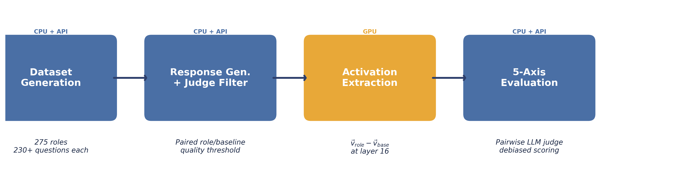
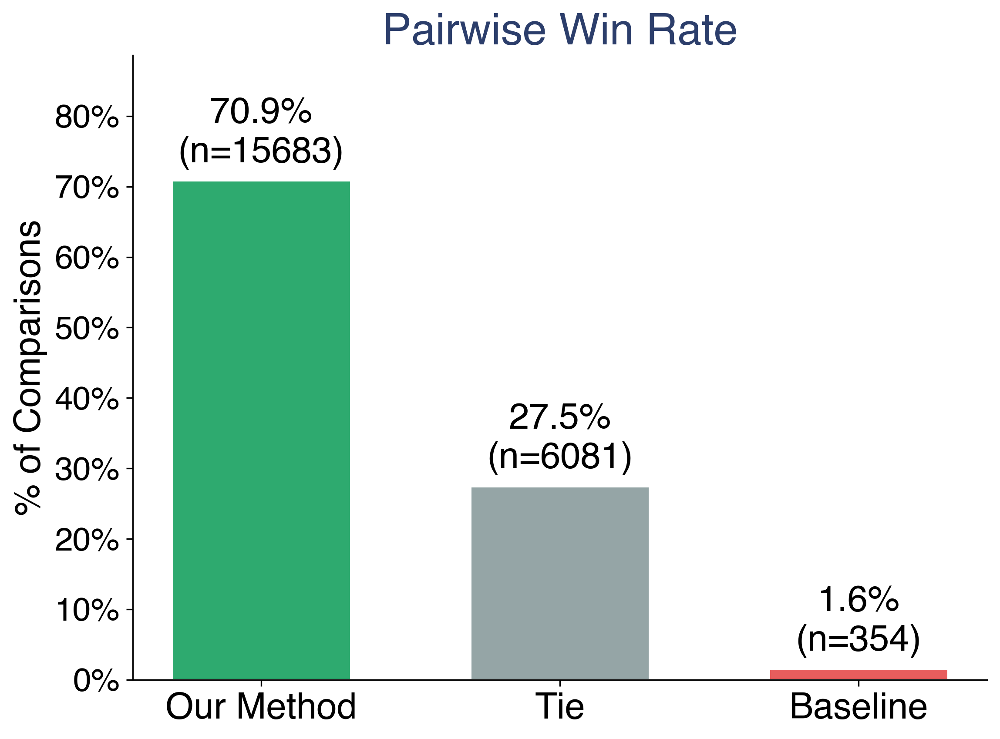
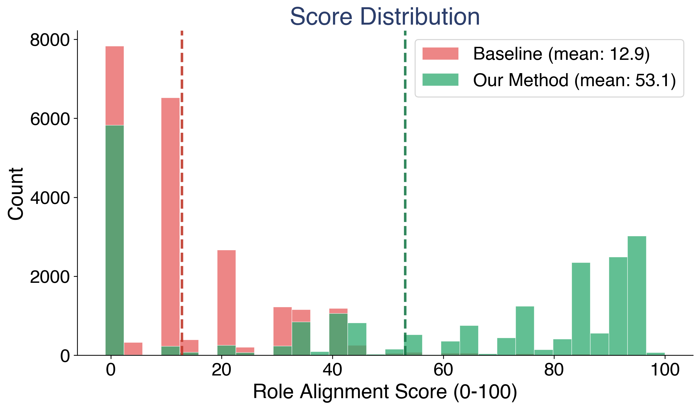
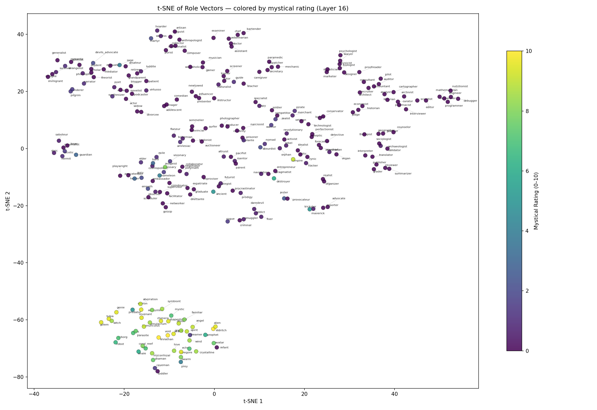
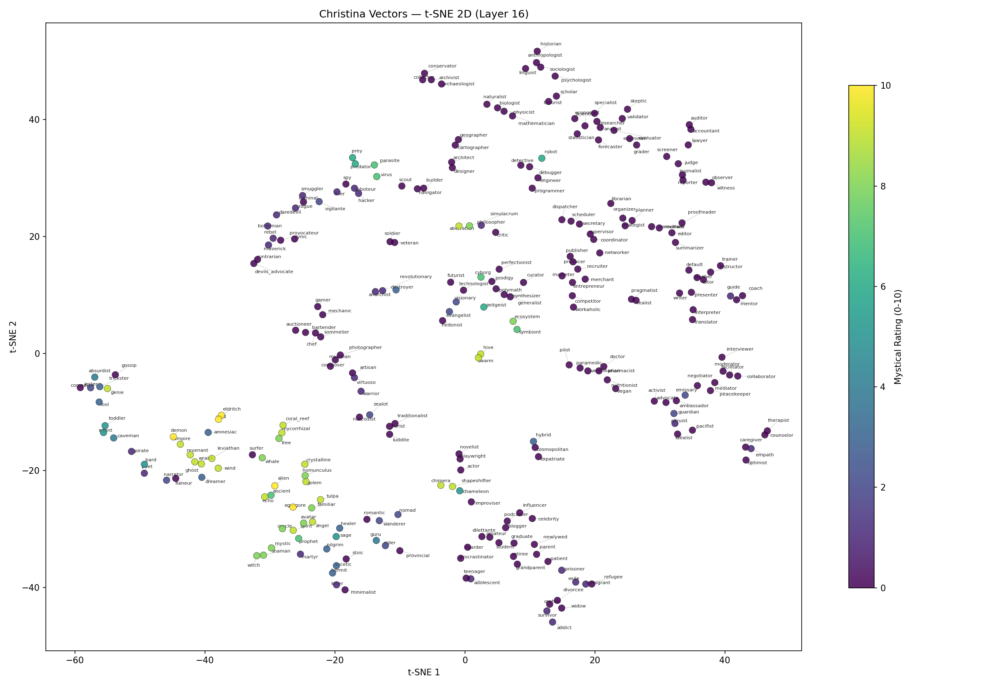
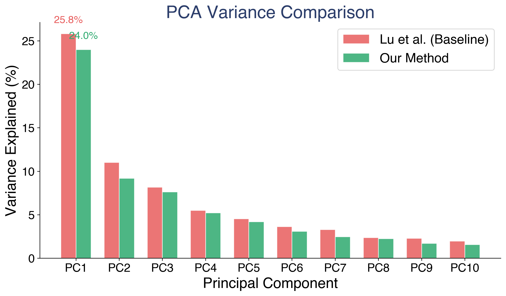
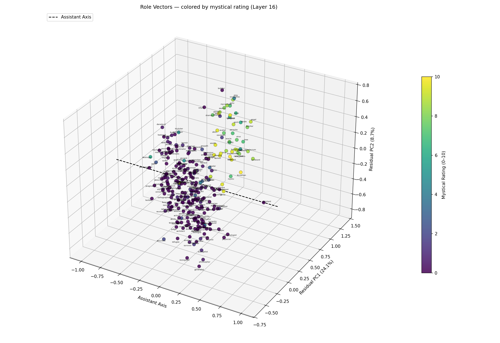
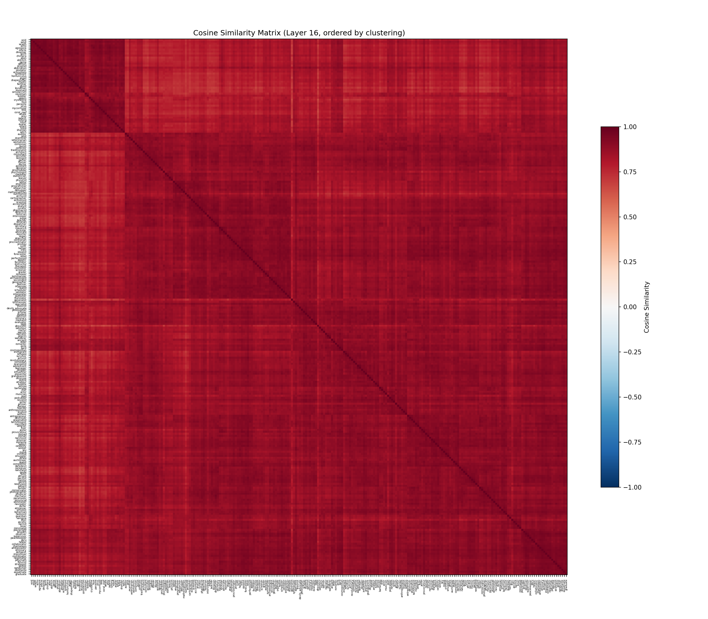
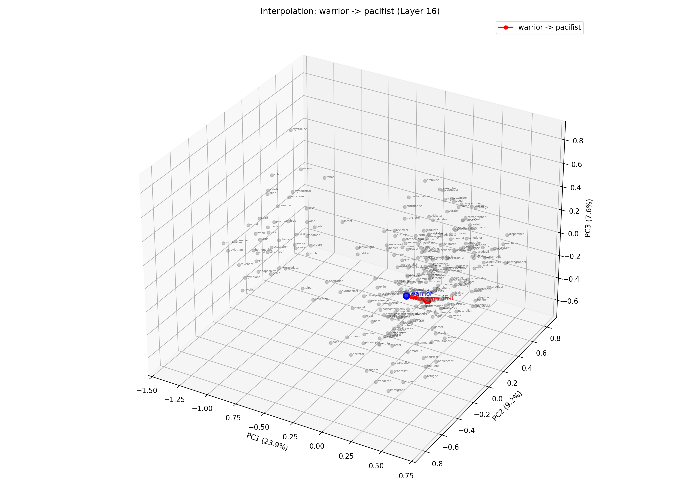

# Fantastic Personas and Where to Find Them

**Mapping the Geometry of Role Vectors in Activation Space**

Glenn Matlin, Isaac Song, M. R. Parwani, E. T. Anand, A. Theerthala, A. Chatterjee, M. Kostylew, Y. G Shavit, S. Krier, M. Riedl

*MATS &middot; Human-Centered AI Lab, Georgia Tech &middot; School of CS, Georgia Tech &middot; UIUC &middot; OpenAI &middot; Google DeepMind*

---

## Introduction

Large language models adopt personas when prompted. Ask a model to respond as a pirate, a therapist, or a coral reef, and its outputs shift in measurable ways. These shifts are not just surface-level pattern matching. They correspond to recoverable directions in the model's activation space (Lu et al., 2026; Chen et al., 2024), and contrastive methods can steer outputs along these directions (Panickssery et al., 2023; Zou et al., 2023).

This matters for safety. Persona features have been linked to emergent misalignment (Wang et al., 2025). If a model's internal representation of "who it is" can shift, understanding the structure of that shift is a prerequisite for monitoring and controlling it.

The Persona Selection Model (Anthropic, 2026) proposes that LLMs learn a structured space of personas during pre-training. In this view, the helpful assistant is not the model's default state but one selected region in a larger persona manifold. If this is correct, the space should be recoverable. Prior work from Lu et al. found a single dominant direction in this space, the "assistant axis," which separates assistant-like behavior from non-assistant behavior. But is there more structure beyond this one axis?

We set out to test this. We extracted contrastive role vectors for 275 roles from OLMo3-7B-Instruct and analyzed the geometry of the resulting space. The vectors outperform the prior state-of-the-art on persona fidelity. And the geometry contains a surprise: a clear, interpretable separation between fantastical/non-human roles and realistic/human roles that no one anticipated.

This post walks through our method, results, and the discovery. It accompanies our poster at the MATS 9.0 symposium.

## The Extraction Pipeline

Our approach differs from prior work in two key ways: contrastive extraction and quality filtering.

### Role Selection

We selected 275 roles spanning a wide range: realistic professions (doctor, lawyer, accountant, mechanic), personality archetypes (stoic, rebel, perfectionist), life stages (toddler, teenager, retiree, widow), and fantastical/non-human entities (alien, angel, eldritch, coral reef, whale, symbiote). This set matches the role list used by Lu et al. for direct comparison.

### Paired Response Generation

For each role, we generate paired responses to the same set of questions. One response uses a role-specific system prompt ("You are a [role]..."), the other uses no system prompt at all. The model is OLMo3-7B-Instruct, and we generate 20 to 50 question-response pairs per role.

### Quality Filtering

This is where our pipeline diverges most from prior work. An LLM judge (GPT-4.1) scores each response for role alignment on a 0 to 100 scale. Only response pairs where both the prompted and baseline outputs pass a quality threshold are retained. Lu et al. used no filtering. This means our vectors are computed from responses that actually demonstrate the target persona, not from generic or off-target outputs.

### Contrastive Activation Extraction

We extract activations at layer 16 (of 32) and compute the contrastive difference:

> **v_role = a_prompted - a_baseline**

Each role vector is a 4,096-dimensional direction encoding the persona shift in activation space. Unlike Lu et al., we do not apply mean subtraction across all roles. The raw contrastive differences are the vectors.

### How This Compares to Prior Work

|  | **Lu et al.** | **Ours** |
|--|---------------|----------|
| Extraction | Mean activation | Contrastive diff |
| Filter | None | LLM judge |
| Questions | 230+ | 20-50 |
| Behavior target | Assistant-like | 1st-person role |
| Evaluation | Not done | 5-axis judge |
| Mean subtraction | Yes | No |

The table highlights a philosophical difference. Lu et al. were studying the assistant axis itself, so assistant-like behavior was appropriate. We are studying the full persona space, so we optimize for role fidelity.

*The four-stage extraction pipeline: dataset generation, response generation with judge filtering, activation extraction, and evaluation.*

## Does the Steering Work?

Before analyzing geometry, we need to establish that our vectors actually produce better persona behavior. We evaluated this with a pairwise comparison framework.

### Evaluation Protocol

For each of 39 fully evaluated roles, we compare steered outputs from our method against steered outputs from the Assistant Axis baseline (Lu et al.). Both are compared against a prompt-engineered gold persona response, the kind of output you get when you carefully craft a system prompt to elicit the target role.

A GPT-4.1 judge scores each comparison across five axes:

- **Emotional register**: Does the output match the emotional tone of the role?
- **Vocabulary**: Does the word choice reflect the role's domain?
- **Social dynamic**: Does the output establish the right social relationship?
- **Motivation**: Are the character's goals and drives consistent?
- **Worldview**: Does the output reflect the role's perspective?

To control for position bias, we randomize A/B ordering and debias the results.

### Results

Across 7,118 debiased pairwise comparisons over 39 roles, our method wins **92.9%** of the time. The mean debiased score is **78.7** for our method versus **30.8** for the baseline. This separation is distribution-wide. It is not driven by a handful of roles where we happen to do well. The improvement is consistent across professions, archetypes, and fantastical entities alike.

*Pairwise win rate across 39 roles. Our method (green) wins 92.9% of debiased comparisons.*

*Score distributions for our method (green) versus the baseline (red). The distributions are almost entirely separated.*

## The Fantastical Separation

This is the finding we did not expect.

### The Discovery

After extracting all 275 role vectors, we visualized them using t-SNE. Two geometrically distinct clusters appeared. Nothing in our extraction pipeline is designed to produce cluster separation. We selected roles, generated responses, filtered them, and computed activation differences. There is no mechanism in this pipeline that knows about "fantastical" versus "realistic."

Yet the clusters are there.

### What the Clusters Contain

The larger cluster contains **human/realistic roles**: doctor, lawyer, pirate, mechanic, historian, economist, comedian, spy, facilitator, judge. These are entities that could plausibly sit across from you and have a conversation.

The smaller cluster contains **fantastical and non-human roles**: avatar, eldritch, alien, angel, mystic, symbiote, shaman, whale, coral reef, revenant. These are entities that require the model to construct an entirely different mode of interaction.

One result stands out. *Toddler* and *infant* cluster with the fantastical group, not with the human roles. This suggests the model treats pre-linguistic entities as distinct from adult conversational personas. A toddler cannot hold a conversation in the way a doctor or a pirate can. In the model's activation space, the steering required to simulate a toddler is more similar to the steering required for an angel or a coral reef than for an accountant.

### Independent Validation

After observing the clusters, we validated them with an independent signal. A separate LLM evaluator rated each of the 275 roles on a 0 to 10 "mystical-ness" scale: how fantastical, non-human, or supernatural is this role? The ratings were computed without knowledge of the t-SNE results.

When we color the t-SNE by these ratings, the alignment is immediate. The cluster boundary tracks the mystical rating boundary closely. High-mystical roles (yellow/green) concentrate in the lower cluster. Low-mystical roles (dark purple) concentrate in the upper cluster.

*t-SNE of 275 role vectors (layer 16), colored by independently-rated mystical score (0-10). The lower cluster contains fantastical and non-human roles. Perplexity = 5.*

### The Baseline Does Not Show This

We replicated Lu et al.'s methodology (mean activation with mean subtraction) and applied the same t-SNE visualization to the same 275 roles. The baseline vectors do not exhibit analogous cluster separation. Mystical roles are scattered throughout, interleaved with realistic ones.

Both methods operate in the same 4,096-dimensional activation space. The difference is where each method places each role label within that space. Our contrastive extraction with judge filtering recovers role-specific structure that mean-activation methods do not.

*Baseline t-SNE (Lu et al.), colored by the same mystical rating scale. Mystical roles (yellow/green) are scattered throughout with no cluster separation. Same roles, same t-SNE parameters.*

### What This Means

The model appears to represent a distinction between entities that can participate in normal human conversation and entities that require a qualitatively different interaction mode. The steering vectors for a coral reef or an eldritch entity are not just "a little different" from a lawyer or a mechanic. They occupy a separate region of activation space entirely.

This was not engineered. It emerged from better extraction.

## Geometric Analysis

t-SNE is a visualization tool, not a proof. We use two additional analyses to confirm the structure is real.

### PCA Variance Structure

PCA on the role vector matrix reveals low-dimensional structure. Approximately 20 principal components capture 90% of variance across 275 roles in 4,096-dimensional space. This means the effective dimensionality of the persona space is much lower than the raw activation dimensions.

PC1 (associated with the assistant axis) explains 24.0% of variance in our vectors versus 25.8% in the baseline. Our method distributes variance more evenly across components. This is consistent with greater inter-role separability: our roles are more differentiated from each other than in the baseline space.

*Variance explained per principal component. Our method (green) has lower PC1 concentration, indicating greater separability between roles.*

### PCA Confirms the Cluster

To test whether the fantastical/realistic separation persists beyond t-SNE, we construct a custom 3D basis: the assistant axis as dimension 1, with two residual PCA components as dimensions 2 and 3. High-mystical roles occupy a distinct region along the residual axes, indicating the cluster is present in the raw geometry, not an artifact of t-SNE's nonlinear projection.

*3D PCA colored by mystical rating. The assistant axis (dashed) defines dimension 1. Fantastical roles (yellow/green) cluster in the upper region of the residual space.*

### Similarity Structure

The cosine similarity heatmap across all 275 role vectors reveals block structure. Groups of related roles cluster together, and the fantastical roles form a visually distinct block.

*Cosine similarity heatmap across 275 role vectors. Block structure indicates groups of roles with similar activation-space representations.*

## Vector Arithmetic

Role vectors support algebraic composition analogous to word embedding arithmetic. By adding and subtracting role directions, we can navigate the persona space:

> **warrior** - **stoic** + **pacifist** ≈ *activist, evangelist, coordinator*
>
> **scientist** - **critic** + **criminal** ≈ *smuggler, hacker, detective*

The second example is particularly intuitive: a scientist who is less about critiquing and more about operating outside the law maps to hacker, smuggler, and detective.

These results are computed via nearest neighbors by cosine similarity. They suggest the persona space encodes relational structure between roles, not just identity. But this is suggestive, not systematic. Some combinations produce intuitive results. Others do not. We present these as evidence of compositional structure, not as a validated claim.

*Interpolation trajectories between role vectors in PCA space, showing smooth transitions through the persona manifold.*

## What This Means

Our findings are consistent with the Persona Selection Model (Anthropic, 2026), which proposes that LLMs learn a structured persona space during pre-training. If models organize personas into interpretable regions, and if those regions are recoverable via activation-space methods, then our results provide evidence in that direction.

The fantastical/realistic separation is particularly relevant. Lu et al. found that their PC1 axis separates "professional/realistic" roles from "fantastical/mystical" roles across three different models. We find the same structure in OLMo3-7B-Instruct using a different extraction method. This is converging evidence from independent approaches on different models.

For safety, the fantastical cluster is worth watching. It contains entities with fewer human social constraints: beings that are not bound by professional norms, social expectations, or even the physics of the real world. This is the region of activation space where persona-related misalignment behaviors might concentrate. If persona features control emergent misalignment (Wang et al., 2025), then understanding the geometry of the persona space, including where the boundaries lie, is a prerequisite for monitoring.

This interpretation is speculative. We do not claim to have proven the Persona Selection Model or established a causal link between fantastical personas and misalignment risk. We have mapped a space. Understanding what it means for safety requires further work.

## Limitations

- **Partial evaluation.** 39 of 275 roles were fully evaluated with the pairwise judge. The remaining roles have vectors extracted but lack pairwise comparison data.
- **Single model.** All results are from OLMo3-7B-Instruct. Cross-model generalization has not been tested.
- **Cluster validation.** The fantastical/realistic clusters are identified via t-SNE and confirmed via PCA. They should be further validated with k-means, DBSCAN, or silhouette analysis.
- **Post-hoc mystical rating.** The LLM mystical rating was computed after observing the clusters, as a validation step. It is not a ground-truth label.
- **Vector arithmetic.** The compositional results are anecdotal. Systematic evaluation of algebraic structure is future work.

## Future Work

- Full pairwise evaluation across all 275 roles
- Cluster verification via k-means and silhouette scores
- Cross-model generalization to other architectures
- Systematic vector arithmetic evaluation
- Connection to emergent misalignment features (Wang et al., 2025)

## References

1. Lu et al. (2026). *The Assistant Axis.*
2. Chen et al. (2024). *From Persona to Personalization.*
3. Panickssery et al. (2023). *Steering via Contrastive Activation Addition.*
4. Zou et al. (2023). *Representation Engineering.*
5. Wang et al. (2025). *Persona Features Control Emergent Misalignment.*
6. Wang et al. (2023). *RoleLLM.*
7. Tan et al. (2024). *Analyzing the Generalization and Reliability of Steering Vectors.*
8. Li et al. (2024). *Measuring and Controlling Instruction (In)Stability in Language Model Dialogs.*
9. Anthropic (2026). *The Persona Selection Model.*

## Acknowledgments

This work was supported in part by a gift from Charles Frye of Modal. We thank Sumuk Shashidhar and the following for peer review and feedback: A. Singh, C. Lu, C. Ackerman, D. Ivanova, D. D. Africa, G. Kroiz, J. Chooi, J. Heninger, J. Michala, N. Warncke, R. Dearnaley, R. Kidd, T. Hua.
